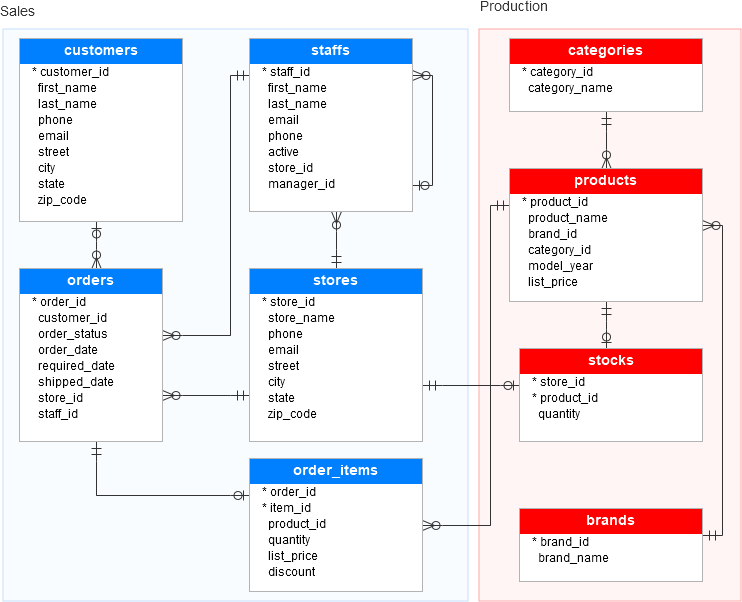

# DBA Challenge 20240802

## Introdução

Nesse desafio trabalharemos utilizando a base de dados da empresa Bike Stores Inc com o objetivo de obter métricas relevantes para equipe de Marketing e Comercial.

Com isso, teremos que trabalhar com várioas consultas utilizando conceitos como `INNER JOIN`, `LEFT JOIN`, `RIGHT JOIN`, `GROUP BY` e `COUNT`.

### Modelo de Dados:

Para entender o modelo, revisar o diagrama a seguir:

## Selects

- As consultas estão no arquivo queries.sql
- Feitas em SQL / PL SQL

>  This is a challenge by [Coodesh](https://coodesh.com/)

